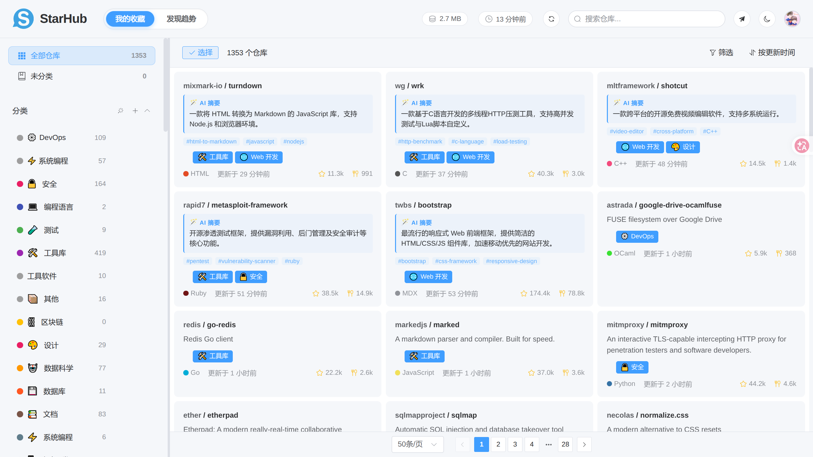
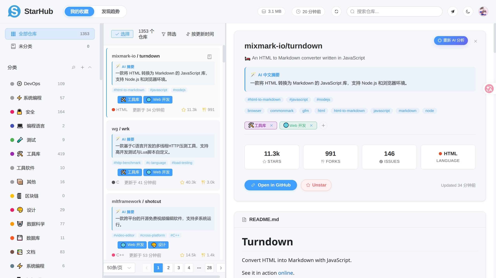
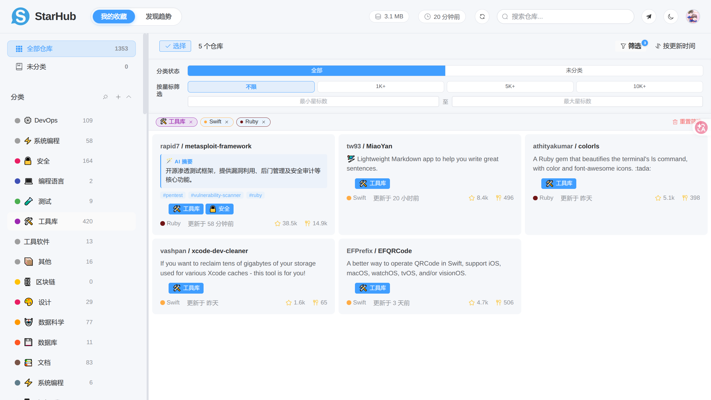
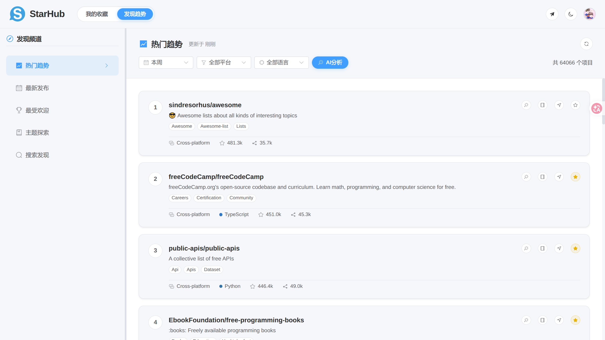
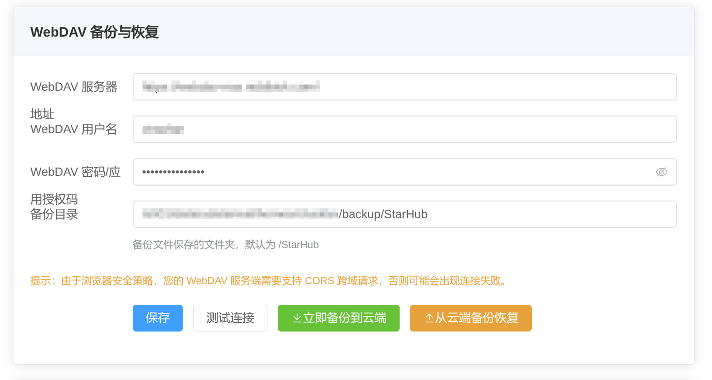

<p align="center">
  
</p>

<h1 align="center">StarHub</h1>

<p align="center">
  <strong>🌟 Professional GitHub Stars Management Tool</strong>
</p>

<p align="center">
  <em>Organize your GitHub Star collection and never lose track of great projects</em>
</p>

<p align="center">
  <a href="README.md">中文</a> | <a href="README.en.md">English</a>
</p>

<p align="center">
  <a href="https://github.com/hujinghaoabcd/StarHub/stargazers"></a>
  <a href="https://github.com/hujinghaoabcd/StarHub/blob/main/LICENSE"></a>
  
  
  
  
  
</p>

<p align="center">
  <a href="#introduction">Introduction</a> •
  <a href="#features">Features</a> •
  <a href="#demo">Demo</a> •
  <a href="#quick-start">Quick Start</a> •
  <a href="#deployment">Deployment</a> •
  <a href="#usage">Usage</a> •
  <a href="#tech-stack">Tech Stack</a>
</p>

---

<a id="introduction"></a>
## 📖 Introduction

**StarHub** is a GitHub Stars management application designed for developers. When your Star count reaches hundreds or even thousands, finding the projects you really need becomes extremely difficult. StarHub was created to solve this problem—it not only syncs all your Star repositories but also provides powerful categorization, search, and AI-powered classification features, making your technical collection truly valuable.

### 🎯 Problems It Solves

- ❌ Starred many excellent projects but can't find them when needed
- ❌ GitHub's native Star list can only be sorted by time, with no categorization
- ❌ Manual organization is too time-consuming and hard to maintain
- ❌ Collections become increasingly chaotic as they grow

### ✅ StarHub's Solution

- ✨ **Smart Tag System** - Custom categories with Emoji and colors
- 🤖 **AI Auto-Classification** - One-click intelligent categorization
- ⚡ **Lightning-Fast Search** - Millisecond response, precise results
- 📖 **README Preview** - Quick project overview without leaving the app
- 🔒 **Local Storage** - Data security, privacy control

---

<a id="features"></a>
## ✨ Features

### 🏷️ Smart Tag System

- **Custom Tags**: Create unlimited tags to organize your collection
- **Emoji Icons**: Each tag supports Emoji for visual identification
- **Color Coding**: 18 preset colors for clear visual distinction
- **Multi-Tag Support**: Add multiple tags to a repository for flexible categorization
- **Batch Operations**: Add/remove tags for multiple repositories at once

### 🤖 AI Intelligent Classification

Supports multiple mainstream AI services:

| Provider | Default Model | Description |
|----------|---------------|-------------|
| OpenAI | gpt-4o-mini | Cost-effective, recommended |
| Claude | claude-3-5-sonnet | Strong understanding capability |
| DeepSeek | deepseek-chat | Fast Chinese model |
| Qwen | qwen-plus | Alibaba Cloud, Chinese-friendly |
| Zhipu AI | glm-4-flash | Chinese model with free quota |

**AI Classification Features:**
- Supports reading README for deep project understanding
- Configurable batch size (default: 50 per batch)
- Supports classifying only unclassified repos or reclassifying all
- Classification accuracy up to 95%+

### 🔍 Full-Text Search & Multi-dimensional Filtering

- **Multi-dimensional Search**: Search by repository name, description, programming language, etc.
- **Local Storage**: Based on IndexedDB, millisecond response
- **Composite Filter Panel**: Added a collapsible filter panel supporting **multi-select tags**, **language filtering**, and **Star range filtering** (preset gradients like 100+, 1k+ are provided).
- **Active Filters Status Bar**: Clearly displays all currently applied filter criteria and supports one-click reset or single item removal.
- **Adaptive Grid Layout**: Supports responsive grid layout (2-4 columns) dynamically adapting to screen size, and automatically scales back to single column when details sidebar is open.

### 📖 README Instant Preview

- Complete Markdown rendering with GFM extensions
- Code syntax highlighting (100+ languages)
- Perfect display of images, tables, and links
- Quick project overview without leaving the app, with built-in previewer for Trending page projects.

### 🌐 Discover Trending (Trending)

- **Trending Channels**: Discover daily/weekly/monthly hottest repositories or newly released open-source apps.
- **Smart Filtering**: Directly filter trending projects by programming languages and platforms (macOS, Windows, Linux, browser extensions).
- **In-App README Reader**: In-app document viewing with robust relative paths and image rendering.
- **Instant Star Subscription**: Subscribe/Star interesting trending projects instantly and save to local IndexedDB.

### ☁️ WebDAV Cloud Sync & Backup

- **Data Roaming**: Configure a private WebDAV server to securely sync and backup your Star categories and tags.
- **Multi-version Backups**: Back up data with one click, preserving both a `latest` backup and historical backups stamped with date and time.
- **Rollback & Restore**: Fetch the backup list from the WebDAV cloud and roll back/restore with one click.
- **Data Status Indicators**: Live database storage footprint estimator and last synced time indicator directly in the top header.

### 🌓 Dark Mode & Multi-language

- Carefully designed dark/light themes
- Auto-switch based on system preferences
- Full Chinese/English bilingual support
- Switch interface language anytime

### 📱 PWA Offline Application

- Install to desktop for native-like experience
- Local data storage, browse and search offline
- Sync once, use anytime

---

## 🏷️ Preset Categories

StarHub includes 18 professional categories covering mainstream tech fields:

| Category | Description | Category | Description |
|----------|-------------|----------|-------------|
| 🌐 Web Development | Frontend, Backend, Full-stack | 📱 Mobile Development | iOS, Android, Cross-platform |
| 🤖 Data Science | ML, AI, Data Analysis | 🛠️ Tools & Libraries | General tools, libraries, frameworks |
| ⚙️ DevOps | CI/CD, Containerization | 🎮 Game Development | Game engines, game tools |
| 💾 Database | SQL, NoSQL, ORM | 🔒 Security | Network security, encryption |
| ⛓️ Blockchain | Web3, Smart Contracts | 💻 Programming Languages | Compilers, interpreters |
| ⚡ System Programming | OS, Low-level development | 🎨 Design | UI/UX, Graphics processing |
| 📚 Documentation | Doc generation, Knowledge management | 🧪 Testing | Test frameworks, automation |
| 😎 Awesome | Curated resource lists | 🟢 Node.js | Node ecosystem |
| ⚛️ React | React ecosystem | 📦 Others | Uncategorized projects |

---

<a id="demo"></a>
## 🌐 Online Demo

> Below are some application interface screenshots. For the full experience, please run locally or wait for the online demo to be available.

<p align="center">
  
</p>
<p align="center">
  Login Interface
</p>

<p align="center">
  
</p>
<p align="center">
  Main Page (Adaptive multi-column grid layout)
</p>

<p align="center">
  
</p>
<p align="center">
  Repository Details (Adaptive multi-column grid layout)
</p>

<p align="center">
  
</p>
<p align="center">
  Multi-dimensional Filter Panel (Multi-select tags, languages, stars, and active filter indicator)
</p>

<p align="center">
  
</p>
<p align="center">
  Discover Trending Page (Trending channels, README preview, AI batch analysis, and direct Star)
</p>

<p align="center">
  
</p>
<p align="center">
  WebDAV Cloud Sync Settings (Rollback history versions list and sync metadata display)
</p>

<p align="center">
  
</p>
<p align="center">
  Documentation Interface
</p>


> 🚧 Online demo is being prepared, stay tuned!

If you have deployed StarHub, you can access it via:

- **Local Development**: `http://localhost:5173`
- **Production**: Access via your deployment platform's domain

---

<a id="quick-start"></a>
## 🚀 Quick Start

### Requirements

- **Node.js** >= 18.0.0
- **npm** >= 8.0.0 or **yarn** >= 1.22.0

### Installation Steps

```bash
# 1. Clone the repository
git clone https://github.com/hujinghaoabcd/StarHub.git
cd StarHub

# 2. Install dependencies
npm install

# 3. Configure GitHub OAuth (see instructions below)

# 4. Start development server
npm run dev

# 5. Visit http://localhost:5173
```

### GitHub OAuth Configuration

StarHub requires GitHub OAuth to access your Star data. Follow these steps:

#### Step 1: Create GitHub OAuth App

1. Visit [GitHub Developer Settings](https://github.com/settings/developers)
2. Click **New OAuth App**
3. Fill in application information:
   - **Application name**: `StarHub` (or any name)
   - **Homepage URL**: `http://localhost:5173`
   - **Authorization callback URL**: `http://localhost:5173/#/login`
4. Click **Register application**
5. Record the **Client ID**
6. Click **Generate a new client secret** and record the **Client Secret**

#### Step 2: Configure Project

1. Copy the template in `src/config/oauth.ts` and update `CLIENT_ID`:

```typescript
export const GITHUB_OAUTH_CONFIG = {
  CLIENT_ID: 'your_client_id_here'
}
```

2. Create `.env` file (for local development):

```env
CLIENT_ID=your_client_id
CLIENT_SECRET=your_client_secret
```

#### Step 3: Start Local Development Server

```bash
# Start OAuth proxy server
node server/dev-server.js

# Start frontend development server in another terminal
npm run dev
```

---

<a id="deployment"></a>
## 📦 Deployment Guide

### Method 1: Cloudflare Pages (Using Wrangler CLI, Recommended)

Cloudflare Pages provides free hosting and supports Cloudflare Workers (Pages Functions) for OAuth handling. This project integrates the `wrangler.jsonc` configuration file and deployment scripts, allowing you to deploy directly from the command line.

#### 1. Log in to Cloudflare

If you haven't logged in, run the following command in your terminal:

```bash
pnpm exec wrangler login
```

#### 2. Build and Deploy

Run the following command to automatically build and deploy your application to Cloudflare Pages:

```bash
pnpm run deploy
```

On your first deployment, Wrangler will guide you through creating or selecting a Pages project (project settings are predefined in `wrangler.jsonc` with the build output directory set to `dist`).

#### 3. Configure OAuth Client Secret

For security reasons, `CLIENT_SECRET` is a sensitive environment variable and should not be hardcoded in the configuration file. Use the following command to securely upload your GitHub OAuth Client Secret to Cloudflare Pages secrets:

```bash
pnpm exec wrangler pages secret put CLIENT_SECRET
```

Alternatively, you can configure the `CLIENT_SECRET` environment variable under your Pages project settings in the Cloudflare Dashboard.

#### 4. Update OAuth Callback URL

In GitHub OAuth App settings, update the authorization callback URL to your Cloudflare Pages domain:

```
https://your-project.pages.dev/#/login
```


### Method 2: Self-Hosting

```bash
# Build
npm run build

# Host dist directory with any static server
# For example, use nginx, Apache, or Node.js static server

# Preview production build
npm run preview
```

> ⚠️ **Note**: Self-hosting requires handling OAuth token exchange backend logic yourself. Refer to `server/dev-server.js` or `functions/api/getToken.ts`.

---

<a id="usage"></a>
## 📖 Usage Guide

### Login

1. Click **Login with GitHub** button
2. Authorize StarHub to access your GitHub account in the popup window
3. Automatically redirect to homepage after successful authorization

### Sync Repositories

- First login automatically starts syncing all your Star repositories
- Sync progress displayed in the top right corner
- Supports incremental sync (only fetch new Stars)

### Using Tags for Classification

#### Manual Classification

1. Click any repository in the repository list
2. Click **Add Tag** in the right detail panel
3. Select existing tag or create new tag

#### Batch Classification

1. Click **Select** button at the top of repository list
2. Check repositories to classify
3. Click **Batch Set Tags** button
4. Select tags to add

#### AI Auto-Classification

1. Go to **Settings** page
2. Configure AI service (API Key, model, etc.)
3. Return to homepage, click **AI Intelligent Classification** button on the left
4. Select classification mode:
   - **Unclassified Only**: Only classify repositories without tags
   - **Reclassify All**: Clear existing classifications and reclassify all
5. Wait for classification to complete

### Search Repositories

- Enter keywords in the top search box
- Support search by repository name, description, programming language
- Click tags on the left to filter by specific category

### View Details

- Click any repository to view detail panel
- Includes basic repository info, programming languages, Star/Fork counts, etc.
- Click **View README** to preview README within the app

### Settings

Visit **Settings** page to configure:

- **AI Service Configuration**: Select AI provider, configure API Key
- **Classification Batch Size**: Adjust number of repositories per AI classification batch
- **Read README**: Enable for AI to read README for more accurate classification
- **Data Management**: Clear data, re-sync

---

<a id="tech-stack"></a>
## 🛠️ Tech Stack

### Frontend Framework

| Technology | Version | Description |
|------------|---------|-------------|
| Vue 3 | ^3.4 | Composition API, reactive system |
| TypeScript | ~5.4 | Type safety, better development experience |
| Vite | ^5.1 | Lightning-fast build, HMR |
| Pinia | ^2.1 | Intuitive state management |
| Vue Router | ^4.3 | Official routing |
| Vue I18n | ^9.14 | Internationalization support |

### UI Components

| Technology | Version | Description |
|------------|---------|-------------|
| Element Plus | ^2.5 | Vue 3 component library |
| SCSS | ^1.71 | CSS preprocessor |

### Data Storage

| Technology | Version | Description |
|------------|---------|-------------|
| Dexie.js | ^3.2 | IndexedDB wrapper library |
| IndexedDB | - | Browser local database |

### Markdown Rendering

| Technology | Version | Description |
|------------|---------|-------------|
| Marked | ^17.0 | Markdown parser |
| highlight.js | ^11.10 | Code syntax highlighting |
| DOMPurify | ^3.0 | XSS protection |
| GitHub Markdown CSS | ^5.8 | GitHub-style styling |

### Other Dependencies

| Technology | Description |
|------------|-------------|
| Axios | HTTP request library |
| vue-virtual-scroller | Virtual scrolling for large datasets |
| query-string | URL query string parsing |

---

## 📁 Project Structure

```
StarHub/
├── public/                   # Static assets
│   ├── logo.svg             # App Logo
│   ├── favicon.ico          # Website icon
│   └── *.js                 # Utility scripts (cleanup, fixes, etc.)
├── src/                     # Source code directory
│   ├── api/                 # API service layer
│   │   ├── auth.ts          # Authentication API
│   │   ├── backend.ts       # Backend API
│   │   ├── github.ts        # GitHub API
│   │   └── request.ts       # Axios wrapper
│   ├── config/              # Configuration files
│   │   ├── ai.ts            # AI service configuration
│   │   ├── categories.ts    # Preset category configuration
│   │   └── oauth.ts         # OAuth configuration
│   ├── db/                  # Database
│   │   └── index.ts         # Dexie database definition
│   ├── i18n/                # Internationalization
│   │   ├── index.ts         # i18n configuration
│   │   └── locales/         # Language packs
│   │       ├── zh.ts        # Chinese
│   │       └── en.ts        # English
│   ├── layouts/             # Layout components
│   │   └── HomeLayout.vue   # Main layout
│   ├── pages/               # Page components
│   │   ├── Login.vue        # Login page
│   │   ├── Home/            # Home page
│   │   │   ├── index.vue    # Home page entry
│   │   │   └── components/  # Home page sub-components
│   │   │       ├── BatchTagDialog.vue    # Batch tag dialog
│   │   │       ├── DetailView.vue        # Detail view
│   │   │       ├── EmptyState.vue        # Empty state
│   │   │       ├── RepoCard.vue          # Repository card
│   │   │       ├── RepoCardTags.vue      # Repository tags
│   │   │       ├── RepoList.vue          # Repository list
│   │   │       └── SideMenu.vue          # Side menu
│   │   └── Settings/         # Settings page
│   │       └── index.vue    # Settings entry
│   ├── router/              # Routing configuration
│   │   └── index.ts         # Vue Router configuration
│   ├── services/            # Business services
│   │   └── ai.ts            # AI classification service
│   ├── stores/              # State management
│   │   ├── repo.ts          # Repository state
│   │   ├── tag.ts           # Tag state
│   │   ├── theme.ts         # Theme state
│   │   └── user.ts          # User state
│   ├── styles/              # Global styles
│   │   ├── main.scss        # Main stylesheet
│   │   └── variables.scss   # SCSS variables
│   ├── types/               # TypeScript types
│   │   └── index.ts         # Type definitions
│   ├── utils/               # Utility functions
│   │   ├── auth.ts          # Authentication utilities
│   │   ├── index.ts         # Common utilities
│   │   └── languageColors.ts # Programming language colors
│   ├── App.vue              # Root component
│   └── main.ts              # Application entry
├── docs/                    # Documentation directory
│   ├── config/              # Configuration documentation
│   ├── deploy/              # Deployment documentation
│   ├── guide/               # Usage guides
│   ├── reference/           # Reference documentation
│   └── troubleshooting/     # Troubleshooting
├── server/                  # Local development server
│   ├── dev-server.js        # OAuth proxy server
│   └── package.json         # Server dependencies
├── functions/               # Workers
│   ├── api/
│   │   └── getToken.ts      # OAuth Token exchange
│   └── tsconfig.json        # TypeScript configuration
├── backups/                 # Backup files
├── package.json             # Project configuration
├── vite.config.ts           # Vite configuration
├── tsconfig.json            # TypeScript configuration
├── tsconfig.node.json       # Node.js TypeScript configuration
├── index.html               # HTML entry
├── LICENSE                  # Open source license
├── CHANGELOG.md             # Changelog
├── CONTRIBUTING.md          # Contributing guide
└── README.md                # Project documentation
```

---

## ❓ FAQ

### OAuth Login Failed

1. Check if `CLIENT_ID` is configured correctly
2. Confirm GitHub OAuth App callback URL matches current address
3. Ensure `node server/dev-server.js` is running for local development
4. Check if `CLIENT_SECRET` in `.env` file is correct

### AI Classification Failed

1. Confirm API Key is configured correctly
2. Check if API balance/quota is sufficient
3. Try reducing batch size (adjustable in settings page)
4. Check network connection

---

## 🤝 Contributing

Contributions are welcome! Please follow these steps:

1. Fork this repository
2. Create feature branch: `git checkout -b feature/your-feature`
3. Commit changes: `git commit -m 'Add some feature'`
4. Push branch: `git push origin feature/your-feature`
5. Submit Pull Request

### Development Guidelines

- Write code in TypeScript
- Follow ESLint rules
- Use Vue 3 Composition API for components
- Commit messages follow [Conventional Commits](https://www.conventionalcommits.org/)

---

## 📄 License

This project is licensed under the [MIT License](LICENSE).

---

## 🙏 Acknowledgments

- [Vue.js](https://vuejs.org/) - Progressive JavaScript framework
- [Element Plus](https://element-plus.org/) - Vue 3 component library
- [Dexie.js](https://dexie.org/) - IndexedDB wrapper library
- [Marked](https://marked.js.org/) - Markdown parser
- All contributors and users

---

<p align="center">
  If this project helps you, please give it a ⭐ Star!
</p>

